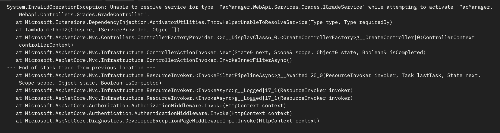

[](https://classroom.github.com/a/HQHot3ui)
# Prueba de Actuación en Clase M5A-AN

Se realizará con *Github Classroom* donde encontrarán el proyecto base y podrán realizar los cambios requeridos.

Se permite usar material.

*Nombre (nro. de estudiante):* ...

## Descripción
Este repositorio contiene el código fuente de un sistema de gestión de PACs (Pruebas de Actuación en Clase). El sistema esta incompleto, con errores y mal diseñado. 

**El objetivo de la actividad es completar el sistema con los nuevos requerimientos y modificaciones y, por último, corregir aquellos que presentan errores.**

````
En la implementación las pruebas PAC se denominan Quiz.
````


## Requerimientos

1. Registrar un nuevo estudiante (nombre, apellido, número de estudiante)
2. Registrar una nueva prueba PAC (nombre, valor)
3. Registrar la nota de una PAC para un estudiante (estudiante, PAC, nota)
4. ***[40%]*** Consultar la nota de una PAC para un estudiante

### Bugs
1. ***[5%]*** Al tratar de insertar una nueva nota (tiempo de ejecución) ocurre el siguiente error:



### Modificaciones requeridas
1. ***[5%]*** Siguiendo buenas prácticas, se requiere que el ciclo de vida de *StudentService* sea dependiente de las solicitudes HTTP. Es decir, que se cree una nueva instancia de *StudentService* por cada solicitud HTTP. 
2. ***[20%]*** Para la clase *QuizService* no se realizaron tests, se requiere que se implementen. Considerar los distintos casos.
3. ***[10%]*** Se requiere que se realice la validación de los *datos de entrada* para la creación de un estudiante. En caso de que los datos no sean válidos, se debe lanzar una excepción.
- *Nombre:* No puede ser nulo ni vacío
- *Número de estudiante:* No puede ser nulo ni vacío
4. ***[20%]*** Se requiere validar que, al registrar una nota de una PAC, el estudiante y la PAC existan. En caso contrario, se debe lanzar una excepción. 

    *Recomendación: visualizar los contratos y métodos ya definidos antes de realizar la validación.*

## Letra

1. Corregir el *bug 1*.
2. Realizar las modificaciones requeridas: *1, 2, 3 y 4*.
3. Realizar el *requerimiento 4* por completo. No se requieren tests.

*En la sección anterior hay un aproximado del porcentaje del total que representa cada requerimiento.*

## Suposiciones

En caso de ser necesario, en esta sección se pueden agregar suposiciones que se consideren necesarias para completar la actividad.
